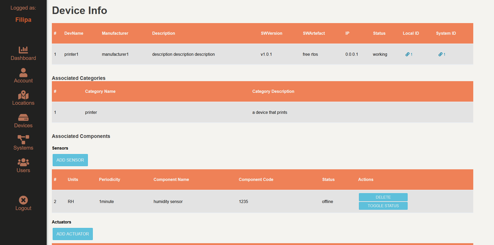

# Device Management System

## Authors: 

[SIBD 2019/2020 - Faculdade de Engenharia, Universidade do Porto]

Ana Barros - up201305683@fe.up.pt

Hugo Rodrigues - up201505296@fe.up.pt

## Context:

This project was developed under the course Information Systems and Databases of Faculty Faculty of Engineering of the University of Porto

## Goals of the project: 

Most companies/institutions make use of different devices, aggregated into systems that belong to different categories. From printers to coffee machines, these systems can become quite complex. 

As such, in order to facilitate the management of such devices that are connected to a network, we decided to develop a software solution for this purpose. 

## System overview: 

Typically, there are several devices in a company. For that reason it is necessary to be able to distinguish them from each other. For that reason, each device should have an ID, IP, name, manufacturer, SW version and artefact, as well as its operational status should be stored. 
Also, depending on the kind of device we are dealing with, its hardware components can be actuators, sensors or both of them.
In general components have associated a name, a code and a status. 
Then if it is an actuator, its function or “side-effect” should be stored, for sensors its periodicity and units should be stored. The user that creates the device can associate one or more categories to it, these categories serve the purpose of making the job of assembling the devices with similar functionalities easier.

Inside a company there are different systems composed by multiple devices that are connected to the network (e.g computer system, the coffee machines system, sprinkler system, etc), a user should know the category and function of a system.
Since a company can have one or more buildings it’s also important to store the
information regarding the location of the device, for this information regarding the location of the building and where the device is inside the building.

Finally, we should make reference to the different kind of users that exist in this
software, for this is important to state that a user can have different kind of permissions depending on the system. There are a total of 3 different kind of permissions of a system, being them Viewer, Editor and Admin. A viewer can only view the status and
information of a device in a system, an Editor can change the information of the devices but can’t create or delete devices, an Admin can create, delete and change information of devices.  

After some iteration the designed system was the following:  

#TODO: insert a new UML with some corrections

#TODO: insert a new Relational model with the same corrections


## How to setup

### Setup SQLite Database

It is recommended to do this process locally in your machine.

1. ```$ sqlite3 mydatabase.db < scripts/db_create.sql```

2. ```$ sqlite3 mydatabase.db < scripts/db_fill.sql```


### Installing in [gnomo.fe.up.pt](gnomo.fe.up.pt)

1. Connect to the server using a SFTP client (e.g. Filezilla or WinSCP)
2. Create a folder named ```SIBD```
3. Move to the ```SIBD``` folder all the required files, namely:
    - ```config``` folder
    - ```devices``` folder
    - ```locations``` folder
    - ```partials``` folder
    - ```resources``` folder
    - ```systems``` folder
    - ```users``` folder
    - ```mydatabase.db``` file
    - ```index.php``` file
4. Access your gnomo homepage.


## Dependencies

- [Font Awesome](http://fontawesome.com/)

## Screenshots





